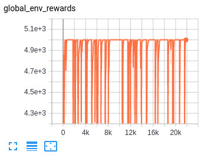

```
def reward_func(ship): 
    return ship.player.halite
```



Although I'd hoped I could be lazy and just tell the algorithm to maximize the amount of halite at the end of the game, after 21k iterations it's still just moving around on the board mining by luck, not building any shipyards, and I'm not surprised at all.  The cost to build a shipyard is 500, and the cost to build a ship from a shipyard is 500.  So whenever the AI decides to build a shipyard but fails to mine 1000 additional halite with no reward shaping whatsoever (which would be a probabilistic miracle to happen once), shipyard conversion gets negatively reinforced.  So yeah it seems I'll have to implement some sort of reward shaping, but if my previous exemplar was any indication I'm optimistic it'll be a pretty simple reward function after all.
