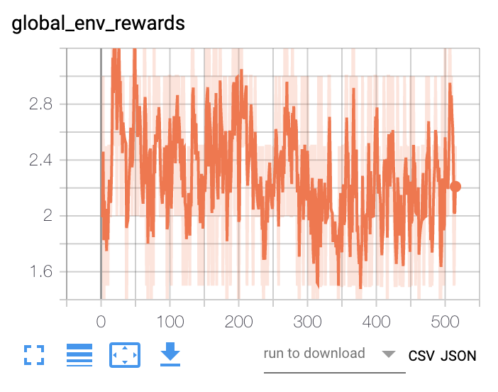

```
def reward_func(ship): 
    return len(ship.player.shipyards.values())
```




I'm still sort of in shock this worked with NO reward shaping.  

Initially with this approach, I tried setting the reward function of the agents to the number of shipyards available to the team.  Although I figured this was a pretty simple goal, I missed a crucial detail: each agent is trying to maximize their own reward, and destroying themselves for no immediate reward was a big bug.  I fixed this by making the reward for destroying oneself the number of shipyards at the end of the game.  I expected it to maybe work a little bit, but I was absolutely astounded to open it up after a good deal of iterations and find out the agents had not only learned to destroy themselves, they'd learned to harvest and build new ships to then convert those additional ships.  
